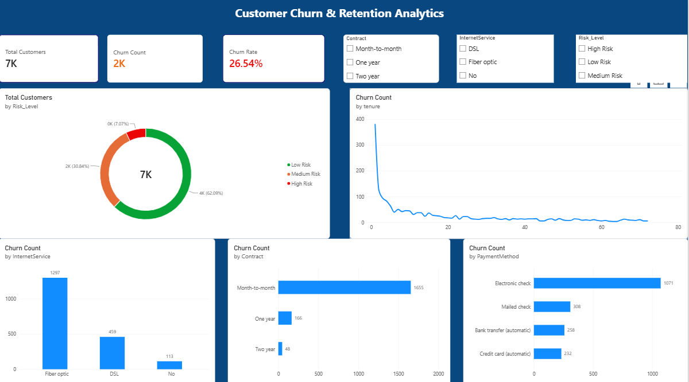

# Customer Churn & Retention Analytics Platform

An end-to-end data analytics and predictive modeling project analyzing customer attrition patterns in telecommunications, generating risk scoring tiers, and surfacing actionable retention insights through an executive Power BI dashboard.

---

## Executive Dashboard


---

## Architecture & Tech Stack

| Layer | Tools | Description |
|---|---|---|
| **Data Extraction & Prep** | SQL | Queried raw records, handled missing entries, and exported the clean dataset. |
| **Exploratory Analysis & ML** | Python (Pandas, Scikit-Learn) | Engineered features, calculated churn probabilities, and classified accounts into operational risk tiers (`Low`, `Medium`, `High`). |
| **Business Intelligence** | Power BI & DAX | Built interactive KPI cards, tenure drop-off line charts, categorical drivers, and dynamic slicers. |

---

## Key Executive Insights

* **Contract Duration Risk:** Customers on **month-to-month contracts** account for **88.5%** of all churn (1,655 out of 1,869 churned customers).
* **Early Onboarding Vulnerability:** The steepest attrition occurs immediately at **Month 1 of tenure**, leveling off substantially after Month 6.
* **High-Risk Segment Profiles:** Accounts utilizing **Fiber optic internet** combined with **Electronic check** payments exhibit the highest churn frequency across all categories.

---

## Core DAX Measures

```dax
Total Customers = COUNTROWS('telco_churn_powerbi_ready')

Churn Count = 
CALCULATE(
    COUNTROWS('telco_churn_powerbi_ready'),
    'telco_churn_powerbi_ready'[Churn] = "Yes"
)

Churn Rate = DIVIDE([Churn Count], [Total Customers], 0)
```

---

## Repository Structure
```text
├── 01_eda_and_feature_engineering.ipynb
├── Customer Churn & Retention Analytics Dashboard.pbix
├── dashboard_preview.png
└── README.md
```
